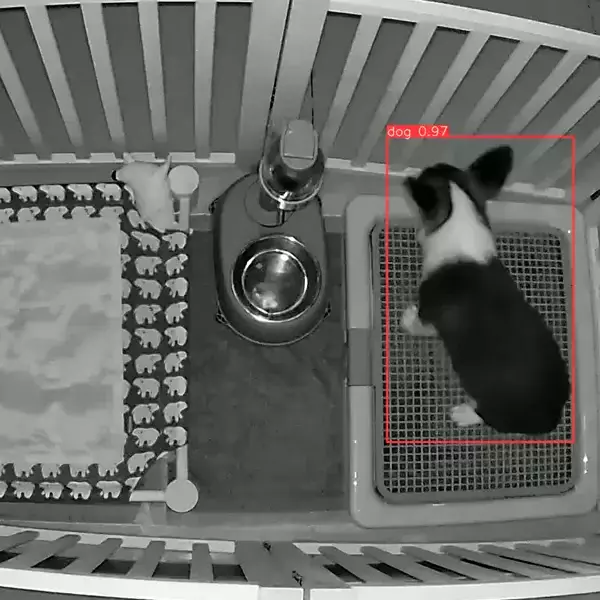

# Dog Poop Detector using YOLOv5
[](https://www.python.org/downloads/release/python-390/)

## Features
- [x] Live detect when dog pooped
    - [x] Play alert sound
    - [x] Send notification via Pushbullet
        - [x] Attach detection image in notification
- [ ] Deployable to Raspberry Pi

## Installation
This project uses [Poetry](https://python-poetry.org/) for package management. If you don't have Poetry installed, you can install it using the following command:

```bash
pip install poetry
```

Once you have Poetry installed, you can install the project dependencies using the following steps:

1. Clone the repository:
```
git clone https://github.com/dennislwy/dog-poop-detector-yolov5.git
```

2. Navigate to the project directory:
```
cd dog-poop-detector-yolov5
```

3. Install the project dependencies:
```
poetry install
```
This will install all the dependencies listed in the `pyproject.toml` file.

Now, you should be able to run the project. For example, to start live detection with an RTSP stream, you can use the following command:

```bash
python live.py --weights poop.pt --view-img --nosave --notify-img --source rtsp://your_rtsp_url
```

## Live Detection
**RTSP Stream**
```bash
python live.py --weights poop.pt --view-img --nosave --notify-img --source rtsp://your_rtsp_url
```

**Testing with MP4 video**
```bash
python live.py --weights poop.pt --view-img --nosave --no-notify --source dataset/tests/test1.mp4
```

### Sample Detection 1

### Sample Detection 2


## Use yolov5 CLI
### Inference
```bash
yolov5 detect --conf-thres 0.7 --line-thickness 2 --view-img --weights poop.pt --source dataset/tests/test1.mp4
```
